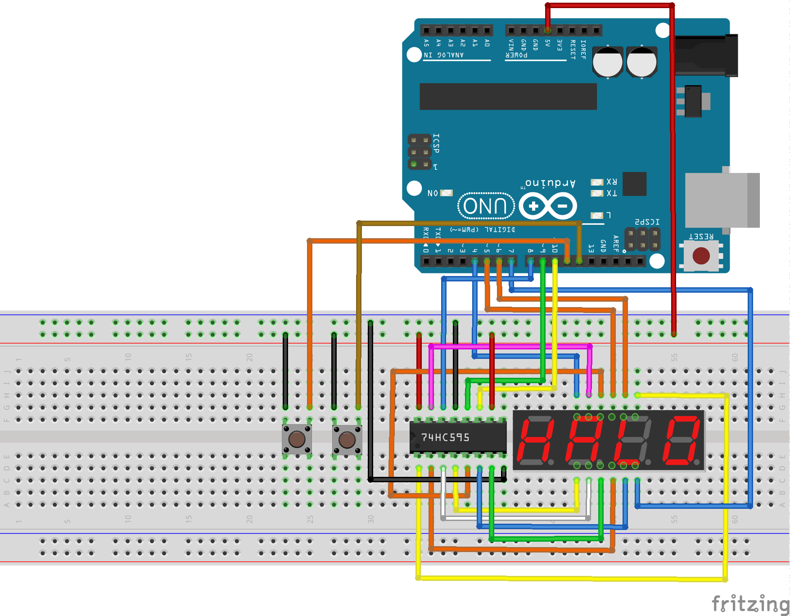

# Counter with speed control.

Arduino project that counts up with four digit 7 segment LED display.

Two switches are connected to pin 11 and pin 22.

Pin 11 is to slow count speed and pin 12 is for faster count.

